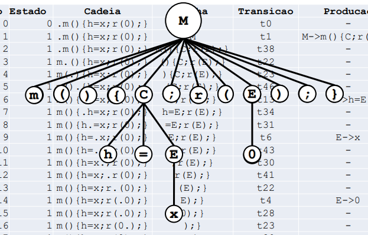
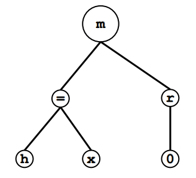
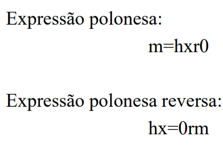
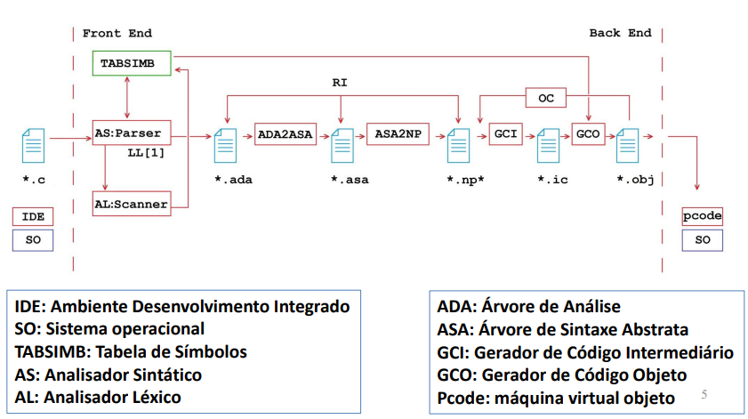

# RELATÓRIO CET058-CMP Projeto 4 - Compilador para C

Relatório da atividade proposta como avaliação da matéria CET058 - Compiladores.

-   Professor: Cesar Alberto Bravo Pariente
-   Aluno: Igor Lima Rocha

# Introdução

O objetivo deste relatório é apresentar o trabalho desenvolvido para a disciplina CET058 - Compiladores, ministrada pelo professor Cesar Alberto Bravo Pariente, no período 2022.2, na Universidade Estadual de Santa Cruz (UESC).

O trabalho consiste na implementação de um compilador para a linguagem de programação C, utilizando os módulos desenvolvidos durante a disciplina, sendo estes: Analisador Sintático (Parser), responsável por analisar a entrada; Analisador Léxico (Scanner), responsável por identificar os tokens; ADA2ASA (Árvore de Análise para Árvore de Sintaxe Abstrata), responsável por gerar a Árvore de Sintaxe Abstrata a partir da Árvore de Análise; ASA2NP (Árvore de Sintaxe Abstrata para Notação Polonesa), responsável por gerar a Notação Polonesa a partir da Árvore de Sintaxe Abstrata; GCI (Gerador de Código Intermediário), responsável por gerar o código intermediário a partir da Notação Polonesa; e GCO (Gerador de Código Objetivo), responsável por gerar o código objeto a partir do código intermediário.

## Objetivos

Implementar um compilador para a linguagem de programação C, utilizando os módulos desenvolvidos durante a disciplina. O compilador deve ser capaz de gerar código objeto p-code, seguindo as regras da gramática descrita nos apêndices.

## Linguagem Aceita

A linguagem aceita pelo compilador é a linguagem C, levando em consideração as seguintes regras:

### Declaração de funções

O compilador aceita a declaração de uma função Main ('m'), ou de uma função auxiliar ('g') juntamente com a função Main, ou duas funções auxiliares ('n' e 'g'), sendo que a função 'n' deve ser declarada antes da função 'g'. A estrutura de uma função é `F() { A; r(E); }`, onde:

-   F: nome da função ('m', 'h' ou 'g')
-   A: conjunto de comandos
-   E: expressão

### Conjunto de comandos

A gramática de um conjunto de comandos é `A`, onde:

-   A -> CB

Sendo que CB é um comando ou um conjunto de comandos aceito pelo compilador.

-   C: comando aceito pelo compilador
-   B: finalização de um comando ('.') ou conjunto de comandos

Os comandos aceitos pelo compilador podem ser vistos na listagem abaixo:

-   Atribuição de função: `h = g()`
-   Comando de atribuição: `j = E`
-   Expressão: `(EXE)`
-   While: `w(E) { CD`
-   If: `f(E) { CD`
-   For: `o(E; E; E) { CD`

'D' é a finalização de um bloco de código ('}') ou um conjunto de comandos aceito pelo compilador.

### Expressões

A gramática de uma expressão é `E`, podendo ser um número inteiro (0...9), uma variável ('x' ou 'y') ou uma operação aritmética. A estrutura de uma operação aritmética é `(EXE)`, sendo que `X` é um operador aritmético ('+', '-', '\*' ou '/').

## Resultados

O compilador foi implementado e testado com sucesso, gerando código objeto p-code para os programas de teste fornecidos pelo professor.

# Módulos

Os módulos desenvolvidos durante a disciplina foram utilizados para a implementação do compilador. A seguir, cada um dos módulos é descrito.

## Analisador Sintático (Parser)

O Analisador Sintático (Parser) é responsável por analisar a entrada (texto), gerando a Árvore de Análise (AA) a partir da entrada. A estrutura da Árvore de Análise é uma árvore n-ária, onde cada nó representa um símbolo da gramática. A estrutura da Árvore de Análise é descrita na Figura 1.



Figura 1: Estrutura da Árvore de Análise

A Árvore de Análise é gerada a partir da gramática descrita nos apêndices, que é utilizada para identificar os símbolos da entrada.

## Analisador Léxico (Scanner)

O Analisador Léxico (Scanner) é responsável por identificar os tokens da entrada. Os tokens são identificados a partir de uma tabela de símbolos, que contém os tokens e seus respectivos valores, podendo ser palavras reservadas, constantes, identificadores ou qualquer outro símbolo da linguagem.

## ADA2ASA (Árvore de Análise para Árvore de Sintaxe Abstrata)

O módulo ADA2ASA (Árvore de Análise para Árvore de Sintaxe Abstrata) é responsável por gerar a Árvore de Sintaxe Abstrata (ASA) a partir da Árvore de Análise (AA). A estrutura da Árvore de Sintaxe Abstrata é uma árvore binária, onde cada nó representa um símbolo da gramática. A estrutura da Árvore de Sintaxe Abstrata é descrita na Figura 2.



Figura 2: Estrutura da Árvore de Sintaxe Abstrata

A Árvore de Sintaxe Abstrata é gerada a partir da gramática descrita nos apêndices, que é utilizada para identificar os símbolos da entrada.

## ASA2NP (Árvore de Sintaxe Abstrata para Notação Polonesa)

O módulo ASA2NP (Árvore de Sintaxe Abstrata para Notação Polonesa) é responsável por gerar a Notação Polonesa (NP) a partir da Árvore de Sintaxe Abstrata (ASA). A estrutura da Notação Polonesa é uma pilha, onde cada elemento da pilha representa um símbolo da gramática. A estrutura da Notação Polonesa é descrita na Figura 3.



Figura 3: Estrutura da Notação Polonesa

A Notação Polonesa é gerada a partir da gramática descrita nos apêndices, que é utilizada para identificar os símbolos da entrada. A Notação Polonesa é utilizada para gerar o código objeto p-code.

## NP2GCI (Notação Polonesa para Geração de Código Intermediário)

O módulo NP2GCI (Notação Polonesa para Geração de Código Intermediário) é responsável por gerar o código intermediário a partir da Notação Polonesa (NP). Fazer uso de uma representação intermediária entre a linguagem de alto nível e a linguagem de máquina é uma técnica utilizada para facilitar a implementação de compiladores, pois facilita a implementação do compilador para outras plataformas de hardware.

## GCI2GCO (Geração de Código Intermediário para Geração de Código Objeto)

O módulo GCI2GCO (Geração de Código Intermediário para Geração de Código Objeto) é responsável por gerar o código objeto a partir do código intermediário. O código objeto é gerado em p-code, semanticamente equivalente ao código de entrada do usuário.

# Metodologia

A metodologia utilizada para o desenvolvimento do compilador foi a metodologia de desenvolvimento de software em cascata, onde cada módulo é desenvolvido e testado individualmente, antes de ser integrado ao módulo seguinte. A Figura 4 mostra os módulos desenvolvidos e a ordem de desenvolvimento.



Figura 4: Metodologia de desenvolvimento de software em cascata

## Cronograma

O cronograma de desenvolvimento do compilador é descrito na Tabela 1.

Tabela 1: Cronograma de desenvolvimento do compilador

| Módulo                                  | Data de término |
| --------------------------------------- | --------------- |
| Proj2b Analisador Descendente recursivo | 17 de outubro   |
| Proj2c ADA2ASA                          | 19 de outubro   |

# Testes

O objetivo dessa seção é descrever os testes realizados para verificar o funcionamento do compilador.

## Teste simples

O teste simples consiste em compilar um programa simples, que possui uma inicialização de variável e um retorno.

### Entrada

O arquivo de entrada para qualquer teste é o programa que será compilado,
o qual neste caso é o programa abaixo.

```c
m(){
    int x;
    x = 1;
    return x;
}
```

### Saída

O arquivo de saída varia de acordo com o módulo em questão. No módulo Parser, o arquivo de saída é uma representação da ADA em forma de vetor, com índices e valores correspondentes em cada posição. Já no módulo ADA2ASA, a saída é a representação da ASA. No módulo ASA2NP*, a saída é apenas a NP* em uma única linha. No módulo NP2GCI, o arquivo de saída é o código intermediário com operações que fazem referência à tabela de símbolos e à pilha. Por fim, no módulo GCI2GCO, o arquivo de saída é a tradução do código intermediário em código objeto, que é a representação do programa de entrada em p-code.


## Teste com 1 chamada de função e 1 while

O teste consiste em compilar um programa que possui uma chamada de função e um while.

### Entrada

O arquivo de entrada para qualquer teste é o programa que será compilado, o qual neste caso é o programa abaixo.

```c
m(){
    h=g();
    w(x){
        k=(1+(1*0))
    };
    r(y);
}
```

### Saída

Seguindo o mesmo padrão do teste anterior, o arquivo de saída varia de acordo com o módulo em questão. No módulo Parser, o arquivo de saída é uma representação da ADA em forma de vetor, com índices e valores correspondentes em cada posição. Já no módulo ADA2ASA, a saída é a representação da ASA. No módulo ASA2NP*, a saída é apenas a NP* em uma única linha. No módulo NP2GCI, o arquivo de saída é o código intermediário com operações que fazem referência à tabela de símbolos e à pilha. Por fim, no módulo GCI2GCO, o arquivo de saída é a tradução do código intermediário em código objeto, que é a representação do programa de entrada em p-code.

## Teste com 1 IF dentro de 1 while

O teste consiste em compilar um programa que possui um while e um if dentro do while.

### Entrada

O arquivo de entrada para qualquer teste é o programa que será compilado, o qual neste caso é o programa abaixo.

```c

m(){
    w(x){
        if(x==1){
            k=(1+(1*0))
        }
    };
    r(y);
}
```

### Saída

Seguindo o mesmo padrão do teste anterior, o arquivo de saída varia de acordo com o módulo em questão. No módulo Parser, o arquivo de saída é uma representação da ADA em forma de vetor, com índices e valores correspondentes em cada posição. Já no módulo ADA2ASA, a saída é a representação da ASA. No módulo ASA2NP*, a saída é apenas a NP* em uma única linha. No módulo NP2GCI, o arquivo de saída é o código intermediário com operações que fazem referência à tabela de símbolos e à pilha. Por fim, no módulo GCI2GCO, o arquivo de saída é a tradução do código intermediário em código objeto, que é a representação do programa de entrada em p-code.

## Teste com outra função além da main

O teste consiste em compilar um programa que possui uma função além da main.

# Apêndices

Abaixo está a gramática utilizada para o desenvolvimento do compilador.

• p1: S → M | G M | N G M
• p4: N → n(){ C; r(E); }
• p5: G → g(){ C; r(E); }
• p6: M → m(){ C; r(E); }
• p6: M → m(){ C; r(E); }
• p7: E → 0 | 1 | x | y | (EXE)
• p12: X → + | - | \* | /
• p16: C → h=E | i=E | j=E | k=E
| z=E | (EXE) | w(E){ C; } |
f(E){ C; } | o(E; E; E){ C; }
